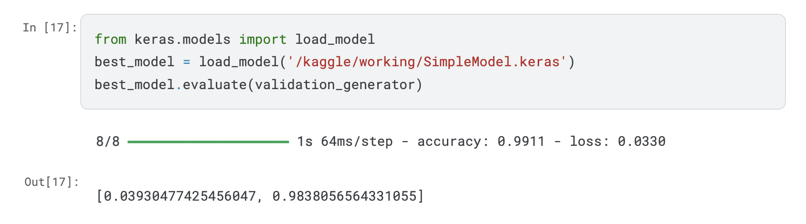
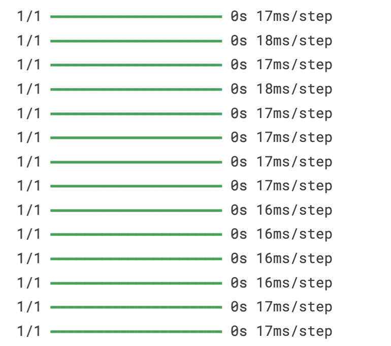
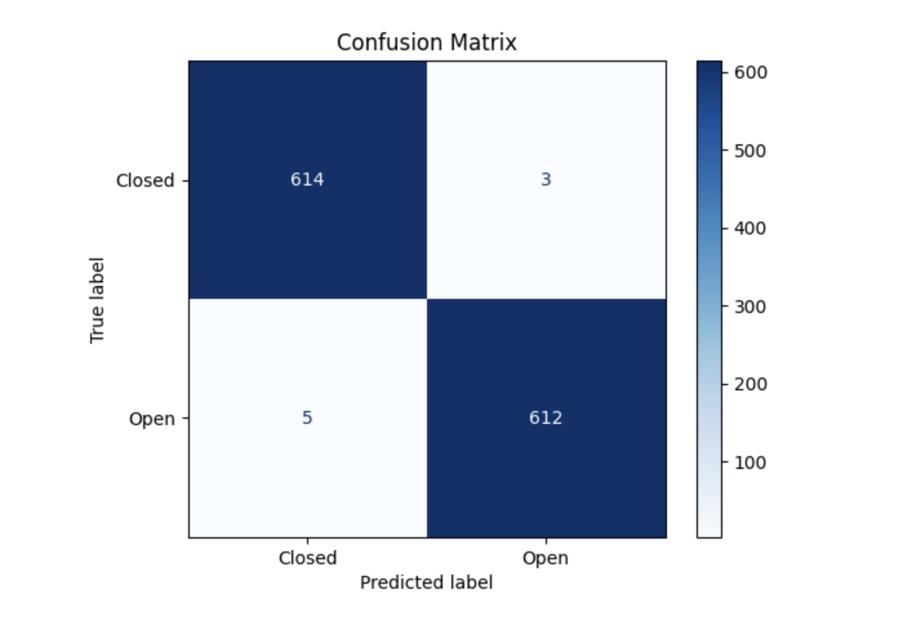
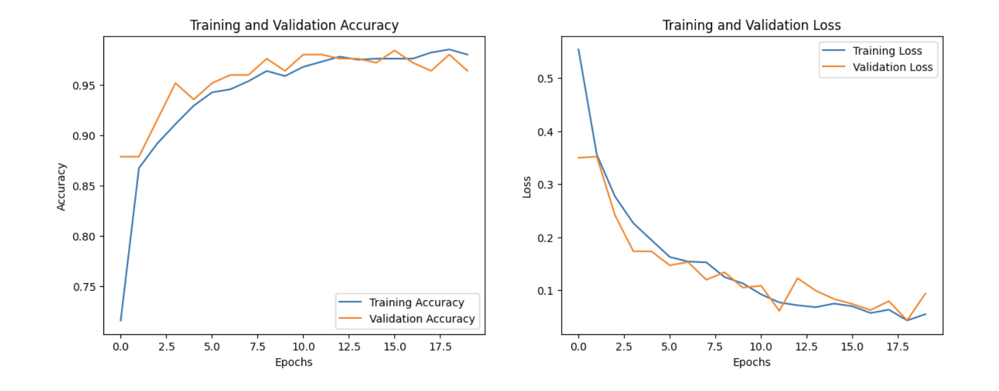

# **Real-Time Driver Drowsiness Detection System**

---

## **Overview and Results**

This project implements a real-time driver drowsiness detection system that uses a CNN model to classify eye states (open or closed) and combines it with MTCNN for robust face and eye detection. By monitoring the driver’s eye gestures, the system can effectively detect drowsiness and issue alerts to enhance road safety.  

### **Key Objectives:**
- Detect faces and eyes in real-time using **MTCNN**.  
- Classify eye states (open/closed) using a custom-trained **CNN model**.  
- Identify drowsiness based on prolonged eye closure.

### **Results:**
- **Accuracy**: Achieved a **99% accuracy** on the eye state classification task using the CNN model.  
- **Processing Speed**: Average processing time is **18ms/step** for classification.  
- **Memory Efficiency**: Optimized for deployment with moderate computational resources.  

This system represents a significant step towards increasing road safety by identifying drowsy drivers in real-time.

---

## **Source Code**

### **Project Structure**
```
├── data/                
│   ├── dataset            # For training CNN model
│   ├── Drowsiness_Val.mp4 # For testing CNN + MTCNN
│   ├── IMG_1494.mov       # For testing CNN + MTCNN
│   └── IMG_1495.mov       # For testing CNN + MTCNN
├── models/                # Trained CNN models
│   └── SimpleModel.keras 
├── src/
│   ├── eyes-open-closed-classification-using-cnn-model.ipynb   
│   ├── drowsiness_tracking.ipynb  
│   └── live_experiment.py         
├── results/
│   ├── Drowsiness_Val_output.avi
│   ├── confusion_matrix.png
│   ├── training_plot.png
│   └── accuracy.png
├── README.md            # Project documentation
└── requirements.txt     # Python dependencies
```
---

## **Performance Metrics**

### **1. Accuracy**
- The CNN model achieved a **99% accuracy** for the binary eye state classification task.  

### **2. Speed**
- **18ms/step** on average for eye state classification with preprocessed frames.
   
### **Visualizations**
1. **Confusion Matrix**:
   

2. **Training Performance**:
   
   
---

## **Installation and Usage**

### **Prerequisites**
- Python >= 3.7
- A compatible GPU (optional for faster inference).

### **Instructions**
1. Clone the repository:
   ```bash
   git clone https://github.com/kangggchan/Drowsiness_Detection_CNN.git
   cd drowsiness-detection
   ```
2. Install dependencies:
   ```bash
   pip install -r requirements.txt
   ```
3. Run the detection system:
   ```bash
   python src/live_experiment.py
   ```

---
## **References and Documentation**

### **Datasets Used**:
1. **[YAWN Eye Dataset](www.kaggle.com/datasets/serenaraju/yawn-eye-dataset-new)**:
   - Used to train the CNN model for eye state classification.  
2. **[Driver Drowsiness Dataset D3S](https://github.com/bindujiit/Driver-Drowsiness-Dataset-D3S-)**:
   - Evaluated the combined performance of the CNN and MTCNN.  

### **Key Papers**:
1. *[Drowsiness detection in real-time
via convolutional neural networks and transfer
learning](https://doi.org/10.1186/s44147-024-00457-z)*.
Salem, D., & Waleed, M. (2024). Drowsiness detection in real-time via convolutional neural networks and transfer learning. Journal of Engineering and Applied Science, 71(1), 1-15.
3. *[Real-Time Driver's Drowsiness Monitoring Based on Dynamically Varying Threshold](http://dx.doi.org/10.1109/IC3.2018.8530651)*
Gupta, Isha & Garg, Novesh & Aggarwal, Apoorva & Nepalia, Nitin & Verma, Bindu. (2018). Real-Time Driver's Drowsiness Monitoring Based on Dynamically Varying Threshold. 1-6.

### **Techniques**:
- **MTCNN**: Multi-task Cascaded Convolutional Networks for real-time face and eye detection and tracking.  
- **Custom CNN Model**: Efficient binary classification of eye states.  

---

## **Issues and Contributions**

### **Known Issues**:
1. **Low FPS** in real-time detection:
   - **Cause**: MTCNN is computationally intensive.  
   - **Solution**: Implementing **fastMTCNN** for faster face detection.  
2. **Passenger Detection**:
   - The model might process faces of passengers in the frame.  
   - **Solution**: Revise the system to focus solely on the driver’s face.  
3. **Limited Features**:
   - Currently, drowsiness is based only on eye gestures.  
   - **Solution**: Add yawning detection for a more comprehensive system.

### **How to Contribute**:
- Report issues or suggest features by opening a GitHub issue.  
- Contribute code via pull requests.  

---

## **Future Work**

1. **Faster Processing**:  
   - Investigate lightweight models like **fastMTCNN** or quantized MobileNet/ResNet50 for deployment on low-end devices.  

2. **Expand Features**:  
   - Integrate yawning detection to complement eye gesture-based analysis.  
   - Focus on filtering out non-driver faces in multi-person frames.  

3. **Driver Behavior Analysis**:  
   - Develop advanced models that combine eye gestures, yawning, and head pose to identify complex driver states.

---

### **Thank You for Your Support!**  
We welcome contributions and feedback to improve this project. Let's make roads safer together!
